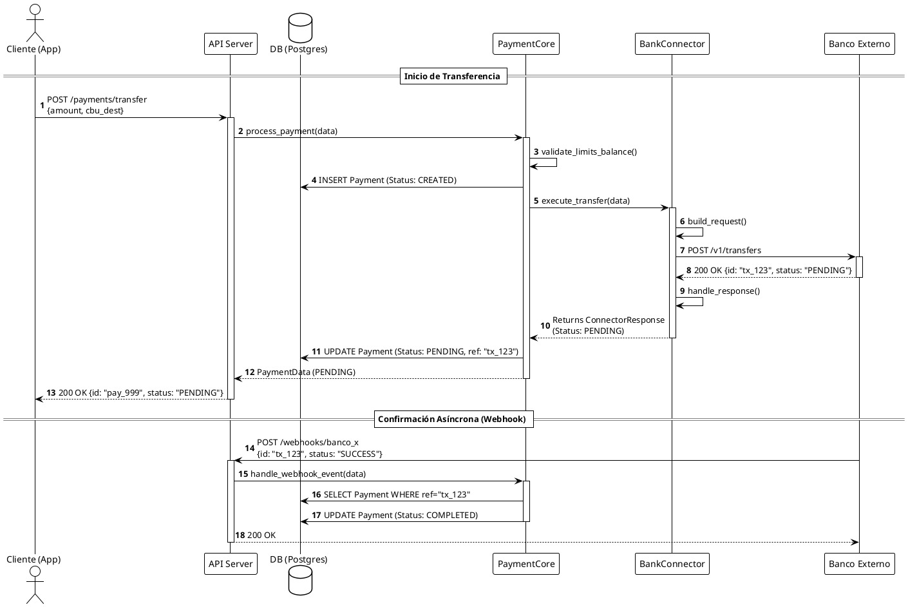

# Diagrama de Secuencia - Transferencia Bancaria (PlantUML)

Este diagrama detalla el flujo de una transferencia saliente hacia un banco externo.

```plantuml
@startuml
!theme plain
autonumber

actor "Cliente (App)" as Client
participant "API Server" as API
database "DB (Postgres)" as DB
participant "PaymentCore" as Core
participant "BankConnector" as Conn
participant "Banco Externo" as Bank

== Inicio de Transferencia ==
Client -> API: POST /payments/transfer\n{amount, cbu_dest}
activate API

API -> Core: process_payment(data)
activate Core

Core -> Core: validate_limits_balance()
Core -> DB: INSERT Payment (Status: CREATED)

Core -> Conn: execute_transfer(data)
activate Conn

Conn -> Conn: build_request()
Conn -> Bank: POST /v1/transfers
activate Bank
Bank --> Conn: 200 OK {id: "tx_123", status: "PENDING"}
deactivate Bank

Conn -> Conn: handle_response()
Conn --> Core: Returns ConnectorResponse\n(Status: PENDING)
deactivate Conn

Core -> DB: UPDATE Payment (Status: PENDING, ref: "tx_123")
Core --> API: PaymentData (PENDING)
deactivate Core

API --> Client: 200 OK {id: "pay_999", status: "PENDING"}
deactivate API

== Confirmación Asíncrona (Webhook) ==
Bank -> API: POST /webhooks/banco_x\n{id: "tx_123", status: "SUCCESS"}
activate API

API -> Core: handle_webhook_event(data)
activate Core
Core -> DB: SELECT Payment WHERE ref="tx_123"
Core -> DB: UPDATE Payment (Status: COMPLETED)
deactivate Core

API --> Bank: 200 OK
deactivate API

@enduml
```
